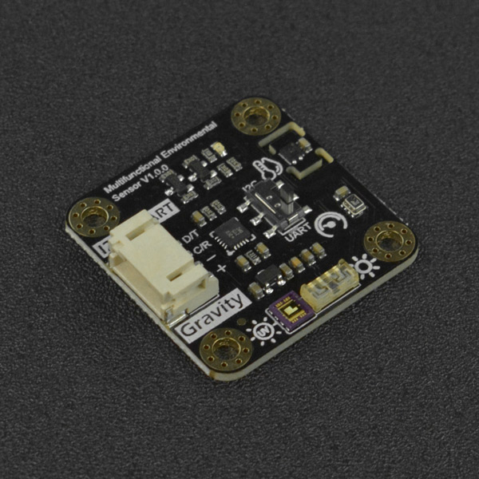
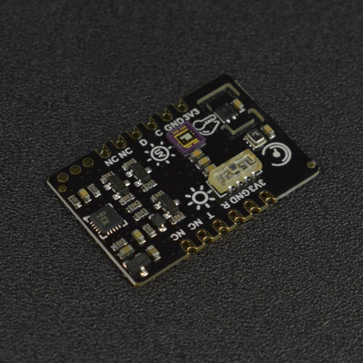

DFRobot_EnvironmentalSensor
===========================

* [中文版](./README_CN.md)

The multifunctional environmental sensor(SEN0500/SEN0501) integrates the UV, illumination, atmospheric pressure and temperature and humidity detection functions into one. It features Gravity and Breakout interfaces, and supports UART and I2C data communication, which can be selected by the onboard switch. <br/>
This Arduino Library developed by DFRobot is specially designed for DFRobot Environmental sensor. Users can use the library to drive their sensor to obtain relevant environmental data conbining with an Arduino mainboard. 



  
## Product Link (https://www.dfrobot.com)
    SKU: SEN0500/SEN0501

## Table of Contents

  * [Summary](#summary)
  * [Installation](#installation)
  * [Methods](#methods)
  * [Compatibility](#compatibility)
  * [History](#history)
  * [Credits](#credits)

## Summary

This multifunctional environmental sensor library can help obtain information like temperature, humidity, pressure, UV intensity, natural sunlight intensity and altitude.
The module also offers Gravity and breakout version for easy use.


## Installation

To use this library, first download the library file, paste it into the \Arduino\libraries directory, then open the examples folder and run the demo in the folder.

## Methods

```C++
  /**
   * @fn begin
   * @brief Init SEN0500/SEN0501 sensor
   * @return Return init status
   * @retval 0  Succeed
   * @retval -1 failed
   */
  int8_t begin(void);

  /**
   * @fn getTemperature
   * @brief Get SEN0500/SEN0501 temperature data
   * @param units Temperature data unit select
   * @n     TEMP_C ℃
   * @n     TEMP_F ℉ 
   * @return Return the obtained temperature data
   */
  float getTemperature(uint8_t unist);

  /**
   * @fn getHumidity
   * @brief Get SEN0500/SEN0501 humidity data 
   * @return Return the obtained humidity data
   */
  float getHumidity(void);

  /**
   * @fn getUltravioletIntensity
   * @brief Get SEN0500/SEN0501 UV intensity index data 
   * @return Return the obtained UV intensity index data
   */
  float getUltravioletIntensity(void);

  /**
   * @fn getLuminousIntensity
   * @brief Get SEN0500/SEN0501 luminous intensity data 
   * @return Return the obtained luminous intensity data
   */
  float getLuminousIntensity(void);

  /**
   * @fn getAtmospherePressure
   * @brief Get SEN0500/SEN0501 atmosphere pressure data 
   * @param units Atmosphere pressure data unit select
   * @n            HPA: Hectopascal
   * @n            KPA: Kilopascal
   * @return Return the obtained atmosphere pressure data
   */
  uint16_t getAtmospherePressure(uint8_t units);

  /**
   * @fn getElevation
   * @brief Get SEN0500/SEN0501 altitude data 
   * @return Return the obtained altitude data
   */
  float getElevation(void);
```

## Compatibility

MCU                | SoftwareSerial | HardwareSerial |      IIC      |
------------------ | :----------: | :----------: | :----------: | 
Arduino Uno        |      √       |      X       |      √       |
Mega2560           |      √       |      √       |      √       |
Leonardo           |      √       |      √       |      √       |
ESP32              |      X       |      √       |      √       |
ESP8266            |      √       |      X       |      √       |
micro:bit          |      X       |      X       |      √       |
FireBeetle M0      |      X       |      √       |      √       |
Raspberry Pi       |      X       |      √       |      √       |

## History

- 2021-08-31 - Version 1.0.0 released.
- 2021-01-18 - Version 1.0.1 released.

## Credits

Written by TangJie(jie.tang@dfrobot.com), 2021. (Welcome to our [website](https://www.dfrobot.com/))
